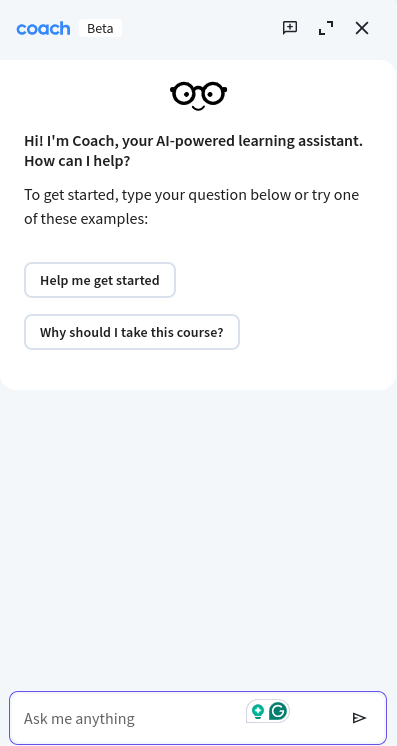

# AI Tutor  
* Think: TA, or Teacher's Assistant

## References
* Tutor in Coursera (Coach), https://www.coursera.org/learn/chatgpt-innovative-teaching/home/module/1
  * You need to have the beta version of Coach. Then you see the image below
  * 
* Tutor for high school students
  * https://www.khanacademy.org/
  * AITutor is similar but for technical training, and it is different in requirements and design
* For creating content
  * https://eurekaa.io/
  * A similar capability should be included in the AITutor

## Description
* AITutor transcribes the recording of the  lesson
* It also gets the materials that the lesson is based on
* It then can do the following
  * Test the student
  * Explain the points that the student did not understand
  * Prepare the student for lessons that are coming up
  * Create training materials in case they do not exists

* It also needs to write materials

## Implementation
* All video input is transcribed and converted to text
* All slide and PDF input converted to text
* Input is broken into meaningful paragraphs that are neither too large nor too small
* The paragraphs are stored in a semantic vector database such as Pinecone
* The dialog flow can be implemented with multi-agent system like CrewAI
* One can also borrow some elements of dialog construction from framework RASA
* The overall success can be implemented with a framework W&B
* Scaling to be done in the cloud with functions (Azure or Google) or lambdas (Amazon)

  * Phase I
  * RAG in Azure take out langchain, 
  * Class - how?
  * Ask questions, not give the answers, but help
  * Ask LLM to help you "To LLM: you are acting as a tutor, not giving answers but helping"
  * You need to practice learning with KhanMigo

## Waiting list
* Cher Devey <cherlearningvip@gmail.com> (Technical learning)
* Tester: Chaim Chesler <rob613@gmail.com> (For MosesAI)
* Keshav Gupta <keshavgupta@knowledgehut.com> (For B2B testing of the business idea)
* Yakir Keinan <yakirk@sela.co.il> (For B2B testing of the idea)
* Gregg Berretta <onlygb@yahoo.com> (MosesAI) 
* Miriam Anzovin (miriamanzovin@gmail.com) (For promoting MosesAI)
