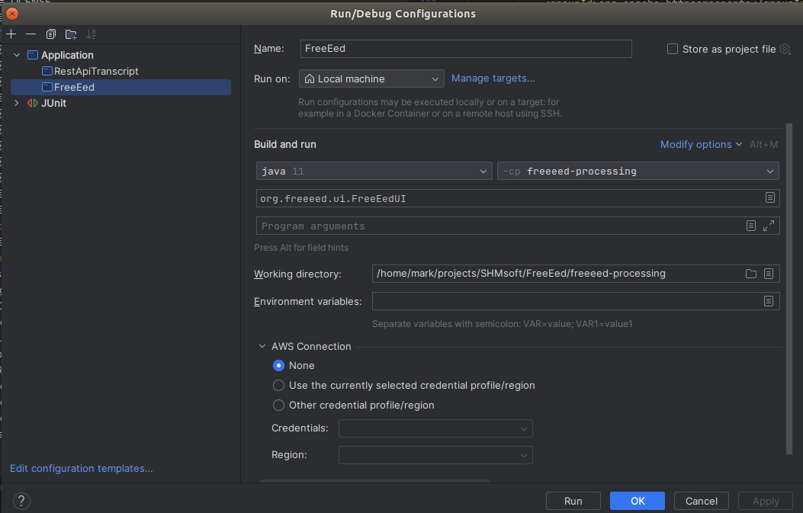
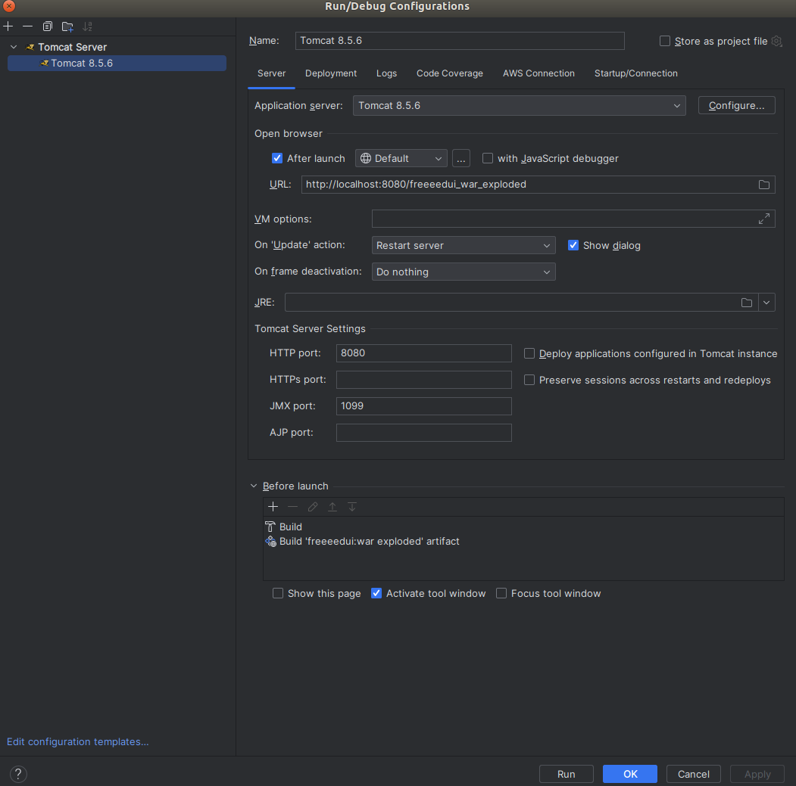

# AIAdvisor

## Complete dev setup

#### Java
[Coretto 17](https://docs.aws.amazon.com/corretto/latest/corretto-17-ug/downloads-list.html)

#### FreeEed Processing
* Install FreeEed complete pack current version, then
```shell
cd freeeed_complete_pack
./start_dev_services.sh 
```
* Clone FreeEed
```shell
git clone git@github.com:shmsoft/FreeEed.git
```
* Run FreeEed in IntelliJ


#### FreeEed Review

* Clone FreeEedUI
```shell
git clone git@github.com:shmsoft/FreeEedUI.git
```
* Run FreeEedUI in IntelliJ
 

#### AIAdvisor

# Python project setup

```shell
wget https://elephantscale-public.s3.amazonaws.com/downloads/Anaconda3-2023.03-Linux-x86_64.sh
chmod +x Anaconda3-2023.03-Linux-x86_64.sh
./Anaconda3-2023.03-Linux-x86_64.sh
conda create --name AIAdvisor python=3.9
conda activate AIAdvisor
./requirements-install.sh
```

* AIAdvisor is in `code/python`
* Run FastAPI
```shell
./run_fastapi.sh
```
