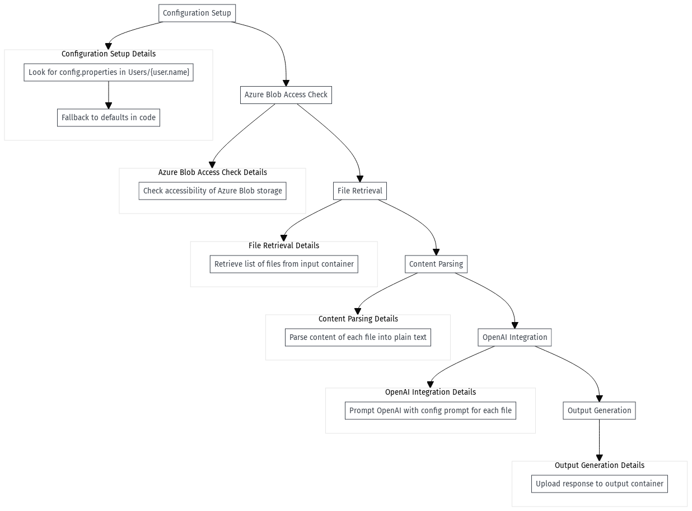

# Form Processing

## Overview

This project is a standalone executable designed to process(meaning of processing is defined below) any form. This required some system dependencies which must be met to run it correctly.

- Java (latest version)
- Tesseract OCR (latest version)
- Tika server (must be up and running)
- A [config.properties](src/main/resources/config.properties) file located in the Users/home/ directory

## Data Flow

1. **Configuration Setup**: Upon startup, the program looks for a [config.properties](src/main/resources/config.properties) file in the `Users/{user.name}` directory or falls back to the defaults in code.

2. **Azure Blob Access Check**: Next, the program checks the accessibility of Azure Blob storage.

3. **File Retrieval**: It then retrieves a list of files from the input container in Azure Blob storage.

4. **Content Parsing**: The program parses the content of each file into plain text for further processing.

5. **OpenAI Integration**: Utilizing Azure OpenAI services, the program prompts OpenAI with the prompt provided in [config.properties](src/main/resources/config.properties) for each file.

6. **Output Generation**: Finally, the response from OpenAI in the desired format is uploaded to the output container in Azure Blob storage for storage.

7. **Awaiting deployment to Azure GOV**